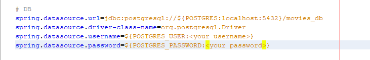

## Name

Movie Database REST Web Services

## Description

A REST Web Services CRUD system involving movies using Spring Framework and PostgreSQL as database. I have tried to use best practises through the whole application's development, so it is quite easy
to keep updating and adding more movie related modules in the future.

Some of the worth pointing out development sections implemented are:\
\
&emsp;&#8226;&emsp;Two different layer DTOs, one for sharing data to the presentation layer and the other one for validating new movie entries or updates,
not only making safer the transactions with user, but also making the classes of models more readable and cleaner\
\
&emsp;&#8226;&emsp;Flyway database migration tool\
\
&emsp;&#8226;&emsp;Exception Handling\
\
&emsp;&#8226;&emsp;Unit Tests\
\
&emsp;&#8226;&emsp;Integration Tests using h2 in-memory database

## Features

Project's features are:\
\
&emsp;&#8226;&emsp;Create <Entity>\
\
&emsp;&#8226;&emsp;Read <Entity>\
\
&emsp;&#8226;&emsp;Update <Entity>\
\
&emsp;&#8226;&emsp;Delete <Entity>

## Getting Started

For running the program you will need to execute the following PostgreSQL commands to create the database and schema used in the application: 

**CREATE DATABASE movies_db OWNER <ins>*your database user*</ins>;**

**\connect movies_db;**

**CREATE SCHEMA movies_schema;**

**GRANT ALL ON SCHEMA movies_schema TO <ins>*your database user*</ins>;**

*Note 1: PostgreSQL version used is 13.1*

After that Flyway will take care the rest of the migration.

*Note 2: It is considered a given that you know how to open the project on your preferred IDE. In this demonstration Netabeans IDE 11.3 is used.*

Opening the project with Netbeans IDE you will have to change username and password values on the application.properties file on <ins>src/main/resources/application.properties</ins> path. They should look like this:

where ***< your username >*** and ***< your password >*** should be changed accordingly.

You are ready to run the application.

