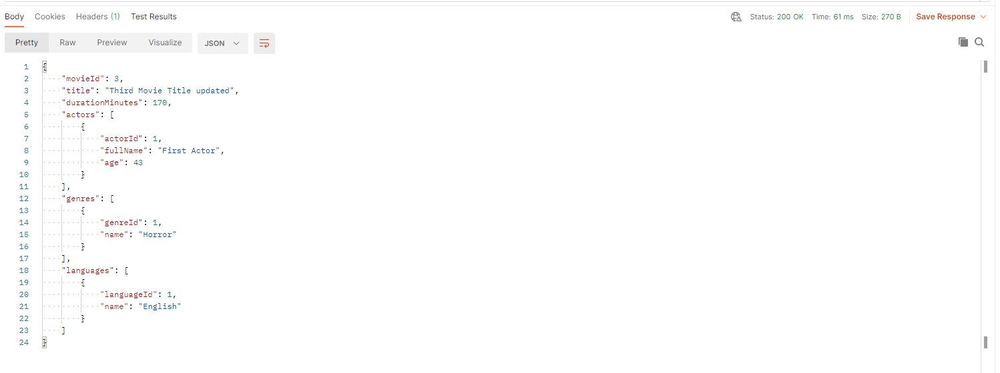

## Name

Movie Database REST Web Services

## Description

A REST Web Services CRUD system involving movies using Spring Framework and PostgreSQL as database. I have tried to use best practises through the whole application's development, so it is quite easy
to keep updating and adding more movie related modules in the future.

Some of the worth pointing out development sections implemented are:\
\
&emsp;&#8226;&emsp;Two different layer DTOs, one for sharing data to the presentation layer and the other one for validating new movie entries or updates,
not only making safer the transactions with user, but also making the classes of models more readable and cleaner\
\
&emsp;&#8226;&emsp;Flyway database migration tool\
\
&emsp;&#8226;&emsp;Exception Handling\
\
&emsp;&#8226;&emsp;Unit Tests\
\
&emsp;&#8226;&emsp;Integration Tests using h2 in-memory database

## Features

Project's features are:\
\
&emsp;&#8226;&emsp;Create <Entity>\
\
&emsp;&#8226;&emsp;Read <Entity>\
\
&emsp;&#8226;&emsp;Update <Entity>\
\
&emsp;&#8226;&emsp;Delete <Entity>

## Getting Started

For running the program you will need to execute the following PostgreSQL commands to create the database and schema used in the application: 

**CREATE DATABASE movies_db OWNER <ins>*your database user*</ins>;**

**\connect movies_db;**

**CREATE SCHEMA movies_schema;**

**GRANT ALL ON SCHEMA movies_schema TO <ins>*your database user*</ins>;**

*Note 1: PostgreSQL version used is 13.1*

After that Flyway will take care the rest of the migration, creating the entity tables and filling them with mock data for the presentation.

*Note 2: It is considered a given that you know how to open the project on your preferred IDE. In this demonstration Netabeans IDE 11.3 is used.*

Opening the project with Netbeans IDE you will have to change username and password values on the application.properties file on <ins>src/main/resources/application.properties</ins> path. They should look like this:

where ***< your username >*** and ***< your password >*** should be changed accordingly.

You are ready to run the application.

## Demonstration

For the purposes of the demonstration <a href="https://www.postman.com/product/api-client/">Postman API Client</a> is used for sending HTTP requests and reading responses.

#### Read Operation

Sending a HTTP GET request on http://localhost:8080/movies/movie will result on returning movie results paginated. Each page holds 10 movies and if user wants to get results from a specific page, the number of the page needs to be given as a parameter on the request, like: http://localhost:8080/movies/movie?page=*< number of page >*.

User can also request for a specific movie by sending a HTTP GET request on the same URL and adding the movie id as a path variable, like: http://localhost:8080/movies/movie/*< movie id number >*

The same goes for actor, genre and language GET requests on http://localhost:8080/movies/actor, http://localhost:8080/movies/genre and http://localhost:8080/movies/language URLs respectively.

#### Create Operation

Sending a HTTP POST request on http://localhost:8080/movies/movie with a JSON Movie object on the body of the request (taking for granted that it passes the validations), it results on creating a new Movie entity on database. The response returns the new saved Movie and a 201 status code indicating that the new entity is created.

The same goes for actor, genre and language POST requests on http://localhost:8080/movies/actor, http://localhost:8080/movies/genre and http://localhost:8080/movies/language URLs respectively.

#### Update Operation

Sending a HTTP PUT request on http://localhost:8080/movies/movie/< movie id > with the updated Movie object on the body of the request on a JSON format (taking for granted once again that it passes the validations) and the movie's id given as a path variable, it results on updating the Movie entity on database and returning the updated Movie object on the response.

The same goes for actor, genre and language PUT requests on http://localhost:8080/movies/actor, http://localhost:8080/movies/genre and http://localhost:8080/movies/language URLs respectively.

#### Delete Operation

Sending a HTTP DELETE request on http://localhost:8080/movies/movie/< movie id > with the movie's id given as a path variable, will result in deleting the selected movie and returning a 204 status code indicating that the server successfully processed the delete request, but is not returning any content.

#### Exception

Sending a HTTP request with an id that doesn't exist on entity's table, results on a custom exception returning as the response, informing user about exception's reason with a message, a status code, the path requested resulting to this exception, exception's name and a timestamp of when the exception occured.

## Technology & Tools

<a href="https://adoptopenjdk.net/index.html">AdoptOpenJDK 11</a>  
<a href="https://netbeans.org/">Apache NetBeans IDE</a>  
<a href="https://maven.apache.org/">Maven</a>  
<a href="https://spring.io/projects/spring-boot">Spring Boot</a>  
&emsp;&#8226;&emsp;Spring Boot DevTools\
&emsp;&#8226;&emsp;Spring Data JPA\
&emsp;&#8226;&emsp;Spring Web Services\
<a href="https://junit.org/junit5/">JUnit 5</a>  
<a href="https://site.mockito.org/">Mockito</a>  
<a href="https://flywaydb.org/">Flyway</a>  
